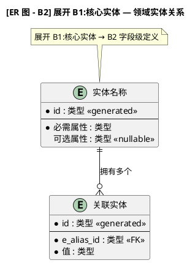

# 代码行为分析图 (Code Behavior Diagram)

分析源码，生成 **PlantUML 业务行为图**，按抽象层级（B1-B4）组织。使用通用的面向对象概念（参与者、组件、实体、事件、信息流、状态、交互）来描述行为，**不依赖任何特定编程语言**。

## B-Level 层级总览

三种图类型共享同一个分层逻辑——**信息密度**随 B-Level 逐级增加。B1 关注"做什么"，B2 关注"谁和谁交互"，B3 关注"数据怎么流动"，B4 关注"具体怎么实现"。

| 层级 | 受众 | 关注点 | 一句话概括 |
|------|------|--------|-----------|
| **B1** | 老板 / PM | 业务意图 | "做什么、为什么做" |
| **B2** | 架构师 | 结构 | "谁跟谁说话" |
| **B3** | 开发者 | 逻辑 | "数据怎么流" |
| **B4** | 开发者 | 实现 | "具体怎么写" |

---

## B-Level 嵌套规则（核心设计）

B-Level 的核心设计原则：**B(N+1) 展开 B(N) 的某个具体元素**，而不是画一张独立的新图。

```
B1: [关机] → [运行中] → [固件升级模式]
                    ↓ 展开
B2:           [运行中] {
                [主循环] → [中断处理]
              }
```

每张 B2 图必须明确它展开的是哪个 B1 元素。使用以下的文件结构和命名约定来表达嵌套关系：

### 文件结构与命名约定

| 文件 | @startuml | 作用 |
|------|-----------|------|
| `b1_state_diagram.puml` | 有 | B1 容器图，在状态内部 `!include` B2 片段 |
| `b2_running_states.puml` | **无** | B2 片段，被 B1 在 `state "运行中" {}` 内 `!include` |
| `b2_dfu_states.puml` | **无** | B2 片段，被 B1 在 `state "DFU" {}` 内 `!include` |
| `b2_state_diagram.puml` | 有 | B2 独立视图，`!include` 同一份片段 |

**B2 片段文件（无 `@startuml`）** 既可被 B1 包含嵌入到状态内部，也可被 B2 独立图包含用于单独查看。内容写一次，双重用途。

### 标题标注约定

| 图类型 | B1→B2 合并图 | B2 独立图 |
|--------|-------------|-----------|
| 状态图 | `[状态图 - B1→B2]` 系统名 | `[状态图 - B2] 展开 B1:运行中` |
| 时序图 | `[时序图 - B1→B2]` 系统名 | `[时序图 - B2] 展开 B1"全部交互"` |
| ER 图 | `[ER 图 - B1→B2]` 系统名 | `[ER 图 - B2] 展开 B1:开发板` |

### PlantUML 表达方式

**状态图：** `state "B1名称" as Alias { !include b2_fragment.puml }` — B2 子状态天然嵌套在 B1 状态框内。

**时序图：** `box "B1名称 [B1]" #color { !include b2_participants.puml }` — B2 组件分组在 B1 参与者框内。

**ER 图：** 标题标注 + `note` 说明展开关系。ER 实体本身不嵌套，通过命名和注释表达层级。

---

## 三种图类型

### 1. 状态转移图 — 必选
**方框** = 状态（系统或对象所处的模式/条件）  
**边** = 事件，触发状态转换。事件发生在哪个 B-Level、以什么粒度描述，由层级决定。

### 2. 时序图 — 必选
**方框** = 参与者（参与者、组件、实体、服务）  
**边** = **信息流**——每条通信线都携带信息。B1 层描述业务意图，B3 层描述具体字段。

时序图中没有"纯粹的事件"：每一次交互都传递了信息。按下按钮传递了{哪个按钮、何时按下}；点亮 LED 传递了{指令=SET, 引脚=PC13}；就连一个空回调也传递了"你该继续了"的信号。**信号本身就是信息。**

### 3. ER 图 — 可选
仅在项目中有值得建模的实体（具有独立标识和关系的领域对象）时创建。没有就算了。

## 通用概念体系

这些概念不依赖任何语言，分析代码时将发现的内容映射到以下概念：

| 概念 | 含义 | 在代码中找什么 |
|------|------|---------------|
| **参与者 (Actor)** | 系统外的交互者 | 用户、外部系统、硬件、定时触发器 |
| **组件 (Component)** | 有明确职责的独立单元 | 模块、包、命名空间、层 |
| **实体 (Entity)** | 有身份、持有状态的对象 | 领域对象、模型、聚合根、数据记录 |
| **服务 (Service)** | 无状态的处理单元 | 工具类、控制器、用例、处理函数 |
| **状态 (State)** | 可区分的模式或条件 | 状态变量、枚举、模式标志、生命周期阶段 |
| **事件 (Event)** | 有意义的发生 | 回调、消息、信号、中断、请求 |
| **交互 (Interaction)** | 参与者之间的信息交换 | 方法调用、函数调用、消息传递、进程间通信 |
| **信息流 (Information Flow)** | 通信中携带的数据 | 参数、返回值、消息体、信号量、指令 |
| **关系 (Relationship)** | 实体之间的连接方式 | 引用、关联、组合、继承、外键 |

---

## 时序图中的信息流 — 详解

时序图的每条边都包含信息。按 B-Level 控制信息的详细程度：

### B1 — 业务意图层
边只描述信息的业务含义，不暴露技术细节。

```
用户 → 登录系统 : 提交登录凭证
登录系统 → 数据库 : 查询用户信息
登录系统 → 用户 : 登录结果
```

### B2 — 信息类型层
边描述信息的类型/结构名称。

```
用户 → 登录系统 : 登录请求{用户名, 密码}
登录系统 → 数据库 : 用户查询{用户标识}
登录系统 → 用户 : 登录响应{成功/失败, 用户信息}
```

### B3 — 字段层
边描述信息包含的具体字段和它们的类型。

```
用户 → 登录系统 : {username: string, password_hash: bytes, timestamp: datetime}
登录系统 → 数据库 : {account_id: int, query_type: string}
登录系统 → 用户 : {status: enum, session_token: string, user_profile: object}
```

### B4 — 精确结构层
边描述信息的精确数据结构，映射到代码中的实际定义。

```
用户 → 登录系统 : LoginRequest{username[32], pwd_hash[64], nonce[16]}
登录系统 → 数据库 : DBQuery{table="users", fields=["id","role","last_login"]}
登录系统 → 用户 : LoginResponse{ok: bool, token: JWT, profile: UserProfile}
```

### 特殊情况

- **控制信号**（如"点亮LED"）：信号本身就是数据 → `{指令=GPIO_SET, 引脚=PC13, 值=HIGH}`
- **空参数调用**（如"获取当前时间"）：隐含数据 → `{操作类型=query, 资源=system_time}`
- **纯通知**（如"处理完成回调"）：隐含数据 → `{事件=process_complete, 状态=success}`

---

## B-Level 统一框架

三种图类型在同一个 B-Level 下应该描述同一抽象层次的视图。以下从"信息密度"维度统一说明：

| B-Level | 状态图 | 时序图 | ER 图 |
|---------|--------|--------|-------|
| **B1** | 业务状态（登录态/离线/在线） | 业务意图（用户提交凭证） | 核心实体名+关系 |
| **B2** | 组件级状态（模块生命周期） | 信息类型（登录请求） | 实体+关键属性+基数 |
| **B3** | 逻辑级状态（守卫条件、子状态） | 信息字段（用户名:string） | 完整属性+类型+约束 |
| **B4** | 实现级状态（精确匹配代码） | 精确结构（LoginRequest{...}） | 字段级定义+键+索引 |

---

## 工作流程

### 第一步：理解代码

阅读并分析代码，提取上述通用概念。对每个模块文件问：

- **这个组件的职责是什么？**
- **它（或整个系统）可能处于哪些状态？**
- **什么事件会导致状态转换？**
- **谁和谁交互，传递了什么信息？**
- **哪些实体存在，它们之间有什么关系？**

### 第二步：确定 B-Level

根据用户需求判断。用户没明确说时主动问：

- "要跟 PM 讲清楚" → **B1**
- "要做架构文档" → **B1 + B2**
- "想知道某个算法怎么工作的" → **B3**
- "要着手实现了" → **B3 + B4**
- "想全面了解" → **B1 + B2 + B3**（B4 看情况）

### 第三步：生成图

对每个选定的 B-Level，判断哪些图类型是相关的，生成 PlantUML 代码。

### 第四步：展示结果

- PlantUML 代码放在 ````plantuml` 代码块中
- 每个图标注类型和层级：`[状态图 - B1]`、`[时序图 - B2]` 等
- 每张图配一段简短文字说明，解释图揭示了什么、值得注意的地方
- 如果用户有 PlantUML 渲染工具，可以帮他们渲染

---

## 各 B-Level 制图指南

### B1 — 业务视图

**状态图**
展示**业务相关的状态**。把内部技术状态折叠到业务状态中。

```
状态: [离线] → [活跃] → [错误]
事件: 开机, 发生故障, 恢复

[离线] → [活跃] : 用户登录 / 系统启动
[活跃] → [错误] : 严重故障
[错误] → [活跃] : 恢复 / 重启
```

**时序图**
信息流描述**业务意图**。参与者是业务角色。

```
用户 → "登录界面" : 提交凭证
"登录界面" → "认证服务" : 验证身份
"认证服务" → "用户库" : 查找用户
"认证服务" → "登录界面" : 结果
"登录界面" → 用户 : 进入主页 / 看到错误
```

**ER 图**
仅核心实体名称和关系。

### B2 — 结构视图

B2 展开 B1 的具体元素。每个 B2 图必须标注它展开的是哪个 B1 元素。

**状态图**
展示 B1 某个状态内部的**组件级子状态**。使用 `state { !include b2_fragment.puml }` 嵌入到 B1 容器中。

```
标题: [状态图 - B2] 展开 B1:运行中
结构: B1"运行中"状态内部包含 [主循环] + [中断处理] 两个组件级状态
```

**时序图**
展示 B1 某个参与者内部的**组件级信息流**。使用 `box { !include b2_participants.puml }` 分组。

```
标题: [时序图 - B2] 展开 B1"全部交互"
结构: B1"开发板"展开为 BSP/EXTI/USB/LEDTest 等内部组件
```

**ER 图**
实体加关键属性和关系基数，标注展开自哪个 B1 实体。

### B3 — 逻辑视图

**状态图**
展示**详细状态**，包括子状态、守卫条件、转换动作。

```
[等待] → [校验中] : 数据到达
[校验中] → [处理中] : 校验通过
[校验中] → [错误] : 校验失败
[处理中] → [等待] : 处理完成
```

**时序图**
信息流描述**具体字段**。

```
用户 → 认证服务 : {username: string, password_hash: bytes}
认证服务 → 数据库 : {account_id: int, query_type: "auth"}
认证服务 → 用户 : {status: "ok"|"fail", token: string}
```

**ER 图**
完整属性加类型和约束。

### B4 — 实现视图

**状态图**
展示**实现级状态**，紧密对应代码中实际的状态追踪。所有可区分的模式、精确的转换条件、进入/退出动作。

**时序图**
信息流描述**精确数据结构**，映射代码中的实际定义。

**ER 图**
字段级定义：类型、可空性、键、索引。

---

## PlantUML 输出规范

始终用 ````plantuml` 代码块包裹，清晰标注每个图。

> **输出方式说明：** 你每次输出的都是一个独立的 PlantUML 代码块。直接使用**内联嵌套**（把 B2 内容直接写在 `state {}` 或 `box {}` 内部），**不需要用 `!include`**。下文展示的 `!include` 模式是多文件项目组织方式——在输出图的说明文字中向用户推荐这种组织方式，但代码块本身是自包含的。

### 文件组织模板（推荐给用户的多文件结构）

推荐的文件组织结构（以状态图为例）：

```
diagrams/
├── b1_state_diagram.puml          # B1 容器图（含 !include B2 片段）
├── b2_running_states.puml         # B2 片段（无 @startuml，被 !include）
├── b2_dfu_states.puml             # B2 片段（无 @startuml，被 !include）
├── b2_state_diagram.puml          # B2 独立图（!include 同一份片段）
├── b1_sequence_diagram.puml       # B1→B2 时序图
├── b2_sequence_diagram.puml       # B2 独立时序图
└── b2_er_diagram.puml             # B2 ER 图
```

### 状态图 — B1 容器模板（含 `!include`）

```plantuml
@startuml
title [状态图 - B1→B2] 系统名称

' B1 状态（外层）通过 !include 嵌入 B2 子状态
state "B1状态A" as StateA {
  !include b2_stateA_fragment.puml
}
state "B1状态B" as StateB {
  !include b2_stateB_fragment.puml
}

' B1 层转换
StateA --> StateB : 事件
@enduml
```

### 状态图 — B2 片段模板（无 `@startuml`）

```plantuml
' B2 片段: 展开 B1"状态名称" — 描述
' 被 b1_state_diagram.puml 在 state "状态名称" {} 内 !include

state "子状态1" as Sub1 {
  [*] --> 细节
}
state "子状态2" as Sub2

[*] --> Sub1 : 进入
Sub1 --> Sub2 : 触发
Sub2 --> [*] : 退出
```

### 状态图 — B2 独立图模板

```plantuml
@startuml
title [状态图 - B2] 展开 B1:状态名称 — 描述

' !include 同一份 B2 片段，确保内容一致
!include b2_stateA_fragment.puml

note top of Sub1
  本图也可通过 !include 嵌入到 B1 状态内部
end note
@enduml
```

### 时序图 — B1→B2 合并图模板

```plantuml
@startuml
title [时序图 - B1→B2] 系统名称 — 业务交互与组件信息流

actor "外部角色" as User

' B1 参与者展开为 B2 内部组件
box "B1组件名称 [B1]" #LightBlue
  !include b2_participants.puml
end box

participant "外部实体" as External

== 阶段1 [B1:业务意图] ==
User -> B1Alias : 操作{信息}
B1Alias -> External : 请求{数据}

== 阶段2 [B1:业务意图2] ==
loop 循环条件
  B1Alias -> Other : 交互{数据}
end
@enduml
```

### B2 参与者片段模板（无 `@startuml`）

```plantuml
' B2 片段: 展开 B1"组件名称"的内部参与者
' 被 b1_sequence_diagram.puml 在 box {} 内 !include

participant "内部组件A" as CompA
participant "内部组件B" as CompB
participant "内部组件C" as CompC
```

### ER 图模板



---

## 命名约定

**状态：** 简短的名词短语或动名词 — `空闲`、`初始化中`、`等待数据`、`处理中`、`错误`。

**事件：** 描述性的过去时，蛇形命名 — `按钮按下`、`数据到达`、`定时器到期`、`校验失败`。用户触发的事件加 `用户_` 前缀。

**参与者（时序图）：** 基于角色的名称 — `用户`、`认证服务`、`数据库`、`消息队列`、`日志记录器`。

**实体：** 单数名词 — `用户`、`订单`、`设备`、`配置`。

**关系：** 方向性动词短语 — `"拥有多个"`、`"属于"`、`"触发"`、`"发送数据到"`。

**信息流（时序图边）：** `动作{数据结构}` 格式。B1 可以没有 `{}`，B2+ 加 `{}` 描述信息内容。

---

## 核心原则

1. **不依赖具体语言。** 用通用概念（参与者、组件、实体、事件、状态、信息流、交互）描述行为。无论是 C、Java、Python、JavaScript 还是其他语言，图都应该能看懂。

2. **按需适配。** 除非用户要求，不要生成所有层级。根据用户要展示给谁、想了解什么来决定粒度。

3. **每张图都要配说明。** 没有上下文的图只是线条和方框。讲清楚图揭示了什么，值得注意的地方——瓶颈、有趣的状态转换、错误路径等。

4. **不确定时如实标注。** 如果某个状态转换或关系从代码里看不清楚，标注为假设。在 PlantUML 中用 `note` 和 `?` 标记不确定的转换。

5. **不是每个层级都需要所有图类型。** B1 时序图可能就足够了，不需要 B1 状态图。自行判断。

6. **不是每个项目都需要 ER 图。** 如果项目没有有意义的领域实体关系，跳过。
