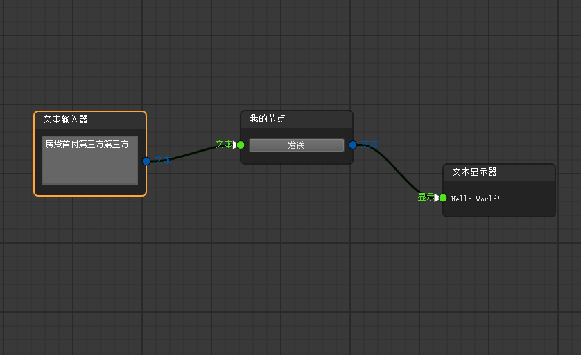

## 环境要求

- Python 3.10.11

## 快速开始

1. 安装依赖

```bash
pip install -r requirements.txt
```


2. 启动应用

```bash
python main.py
```

## 框架说明
此框架是在 nodeeditor 基础上开发的, 项目生命较短, 所以开发过快, 已成屎山, 所以不建议轻易改动, 具体请参考: ./doc/设计文档.md

### 添加节点示例
在 connnodes 目录下创建文件 my_node.py
```python
from qtpy.QtWidgets import QPushButton, QVBoxLayout
from PyQt5.QtCore import pyqtSignal

from conn_conf import register_node
from conn_base import ConnNode, ConnSocketConf, ConnNodeContentWidget
from conn_utils import easyInfo

class MyNodeContent(ConnNodeContentWidget):
    # 定义信号
    sendHelloWorldNotify = pyqtSignal(str)

    def initUI(self):
        layout = QVBoxLayout(self)
        sendBtn = QPushButton("发送", self)

        self.setLayout(layout)
        layout.addWidget(sendBtn)

        sendBtn.clicked.connect(self.sendHelloWorld)

        self.resize(50, 100)

    def sendHelloWorld(self):
        self.sendHelloWorldNotify.emit("Hello World!")

    def receiveSlot(self, text: str):
        """槽函数"""
        easyInfo(f"收到文本: {text}")

    def cleanup(self):
        """自定义清理"""
        easyInfo("自定义清理")
        ...


@register_node()
class MyNode(ConnNode):
    tppath = ("自定义", "我的节点")
    icon = "icons/er.png"
    name = "我的节点"
    tooltip = None
    conn_title = "我的节点"

    NodeContent_class = MyNodeContent

    def __init__(self, scene):
        super().__init__(scene, 
            # 定义信号端口
            # 颜色 (整数) (可选)
            # 信号键 (字符串) (必填)
            # 提示 (字符串) (可选)
            # 名称 (字符串) (可选)
            # 参数类型 (元组) (可选)
            signalsConf = [
                ConnSocketConf(
                    socketType=2,
                    key="send",
                    tooltip="发送Hello World!",
                    name="文本",
                    argsType=(str,)
                )
            ],

            # 定义槽函数端口
            slotsConf = [
                # 颜色 (整数) (可选)
                # 槽函数键 (字符串) (必填)
                # 提示 (字符串) (可选)
                # 名称 (字符串) (可选)
                # 参数类型 (元组) (可选)
                ConnSocketConf(
                    socketType=1,               
                    key="receive",      
                    tooltip="接收Hello World!",
                    name="文本",
                    argsType=(str,)
                )
            ]
        )

        # 注册信号, "send" 键
        self.registerSignal("send", self.content.sendHelloWorldNotify)
        # 注册槽函数, "receive" 键
        self.registerSlot("receive", self.content.receiveSlot)

        easyInfo("我的节点创建成功！")
```

