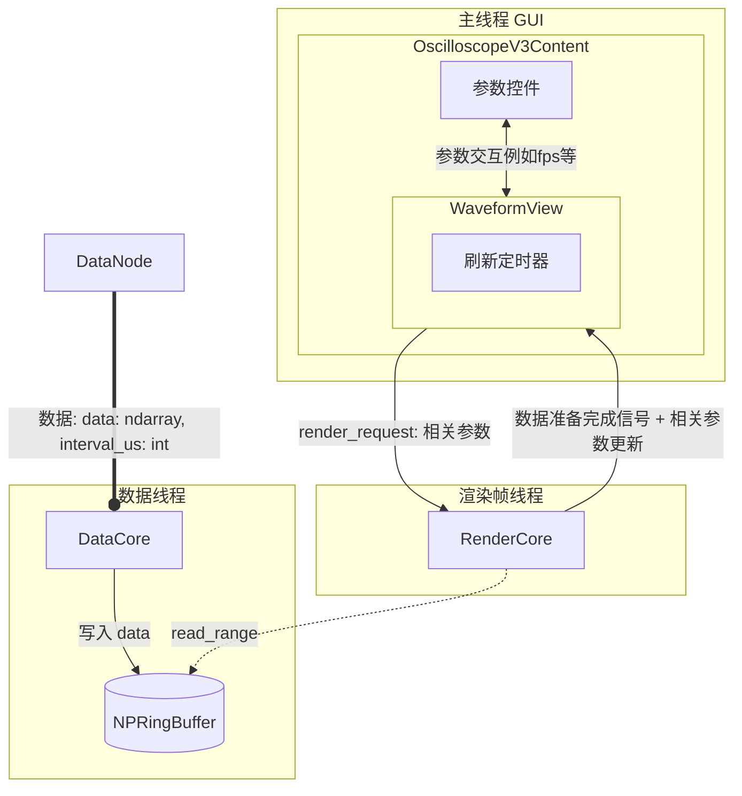
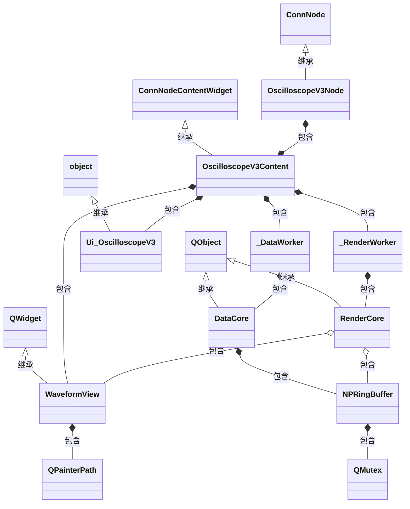
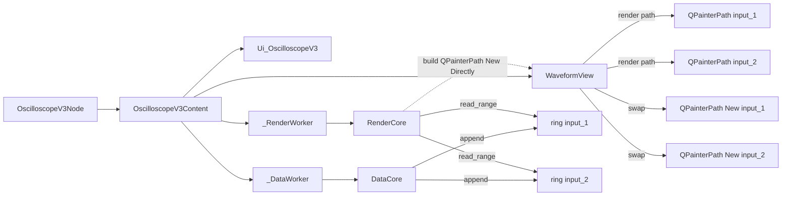

# 示波器 V3

## 关于优化的大概准则
所有耗时的操作都应在其他线程进行，以避免阻塞 GUI 线程。

## 组件 + 线程 + 数据流

能大概体现性能优化方向, 大概符合优化准则。

## 类图

大概指导如何编码与更细致的性能优化

| 类 | 基类 | 线程 | 职责 |
|---|---|---|---|
| `OscilloscopeV3Node` | `ConnNode` | GUI | 端口注册 |
| `OscilloscopeV3Content` | `ConnNodeContentWidget` | GUI | UI 控件、双线程管理、刷新定时器、渲染请求路由 - 请求处理渲染数据 |
| `DataCore` | `QObject` | 数据决策 | 写入存储器 |
| `RenderCore` | `QObject` | 渲染帧 | 渲染请求响应 - 准备渲染数据并通知 GUI |
| `NPRingBuffer` | 无（纯 numpy） | 跨线程 | 存储历史数据 |

## 实例连线图

更细致地指导如何编码与更细致的性能优化

> 一个 `OscilloscopeV3Node` 内部各运行时实例的引用关系。

## 用户参数

| 项 | 类型 | 默认值 | 说明 |
|---|---|---|---|
| `x_window_ms` | float | 1000 | 时间窗口 |
| `y_window_mv_1` | float | 2000 | 输入 1 Y 轴窗口 |
| `y_offset_mv_1` | float | 0 | 输入 1 Y 轴偏移量 |
| `y_window_mv_2` | float | 2000 | 输入 2 Y 轴窗口 |
| `y_offset_mv_2` | float | 0 | 输入 2 Y 轴偏移量 |
| `x_div` | float | 1000us | X 轴格数 |
| `y_div` | float | 2000 | Y 轴格数 |
| `x_scroll` | int \| None | None | X 轴滚动位置（采样点索引）。None=自动滚动（窗口始终跟最新数据尾部），int=手动滚动到此索引位置。int 状态下拖到最右端自动回 None |
| `fps` | int | 30 | 渲染帧率上限 |
| `data_interval` | 只读 | 来自数据 | 由上游协议解析器提供 (`interval_us`)，非用户配置 |
| `memory_depth` | int | 10000 | 存储深度 |