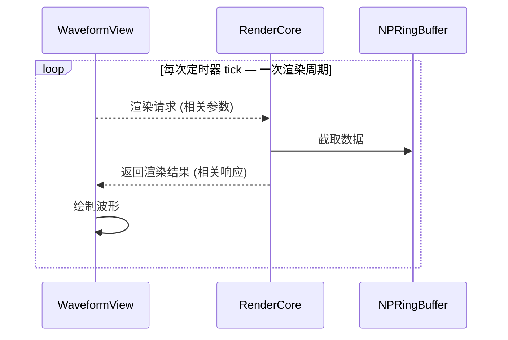

## 时序



> 渲染请求由 WaveformView 内部刷新定时器发送，包含相关参数。


## 渲染请求处理 - 代码示例

```python
import math

class RenderCore(QObject):
    def on_render_request(self, params: dict) -> None:
        """
        注意这只是处理逻辑的示例，可能忽略了边界条件，仅供参考。

        params 键名参考 总体.md 四的用户参数表：
            x_window_ms, x_scroll,
            y_window_mv_1, y_offset_mv_1,
            y_window_mv_2, y_offset_mv_2,
            screen_w, screen_h, interval_us
        """
        interval_us = params["interval_us"]
        if interval_us <= 0:
            return

        # 计算时间窗口对应点数和线段数
        window_linecount = params["x_window_ms"] * 1000 / interval_us
        window_pt = math.ceil(window_linecount) + 1

        # 总点数（取两通道最长）
        total_pts = max(len(self.ring_1), len(self.ring_2))

        # 根据 x_scroll 计算 start 点
        x_scroll = params.get("x_scroll")
        start = ...

        # 读取 ring 数据, 跨线程需要加锁, 这里忽略锁的实现
        data_1 = self.ring_1.get_range(start, window_pt)
        data_2 = self.ring_2.get_range(start, window_pt)

        # 构建路径
        self._waveform_view.pending_path_1 = self._build_path(data_1, ...)
        self._waveform_view.pending_path_2 = self._build_path(data_2, ...)

        # 渲染响应, 可能需要更新滑动条等
        self.waveform_ready.emit(...)

    @staticmethod
    def _build_path(data: np.ndarray, ...) -> QPainterPath | None:
        """构建 QPainterPath

        两种模式:
          直接模式（window_linecount / screen_w ≤ 2）:
            不降采样，每个点按时间比例定位（px_per_pt = screen_w / window_linecount）
          降采样模式（window_linecount / screen_w > 2）:
            每像素一个桶，取 min/max 画竖线
        """
        path = QPainterPath()

        if window_linecount / screen_w <= 2:
            # 直接模式：不降采样, x步长为 px_per_pt = screen_w / window_linecount
            for i in range(len(data)):
                # 注意 gap 点是 np.nan，需要跳过
                ...
        else:
            # 降采样模式：每个像素一个桶，取 min/max 画竖线, x步长为1
            k = round(window_linecount / screen_w + 1)
            data_max, data_min = RenderCore.downsample_peak(data, k)

            for i in range(len(data_max)):
                # 注意 gap 点是 np.nan，需要跳过
                ...

        return path

    @staticmethod
    def downsample_peak(data: np.ndarray, k: int) -> tuple[np.ndarray, np.ndarray]:
        """峰值降采样，返回 (max, min) 各 M 个"""
        n = len(data)
        M = n // k
        data_max = np.empty(M, dtype=data.dtype)
        data_min = np.empty(M, dtype=data.dtype)
        for i in range(M):
            bucket = data[i * k:(i + 1) * k]
            data_max[i] = np.max(bucket)
            data_min[i] = np.min(bucket)
        return data_max, data_min
```

## 渲染响应处理 - 代码示例

```python
class WaveformView(QGraphicsView):
    # ── active QPainterPath：paintEvent 读这俩 ──
    path_1: QPainterPath | None = None
    path_2: QPainterPath | None = None

    # ── pending QPainterPath：RenderCore 写这俩，on_render_path 交换 ──
    pending_path_1: QPainterPath | None = None
    pending_path_2: QPainterPath | None = None


    def on_render_path(self, ...) -> None:
        """
        收到 waveform_ready → 交换双缓冲
        """
        # 交换双缓冲：pending → active，旧 active 丢弃
        self.path_1, self.pending_path_1 = self.pending_path_1, self.path_1
        self.path_2, self.pending_path_2 = self.pending_path_2, self.path_2

        # 可能的处理滑动条相关逻辑
        ...

    def paintEvent(self, event) -> None:
        # 其他逻辑
        ...

        # 绘制波形路径
        if self.path_1 is not None:
            painter.setPen(self._pen_1)
            painter.drawPath(self.path_1)

        if self.path_2 is not None:
            painter.setPen(self._pen_2)
            painter.drawPath(self.path_2)

        # 其他逻辑
        ...
```